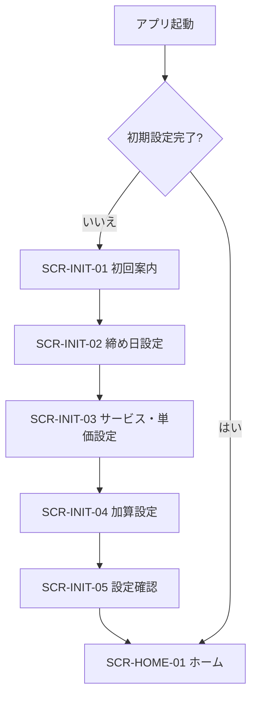
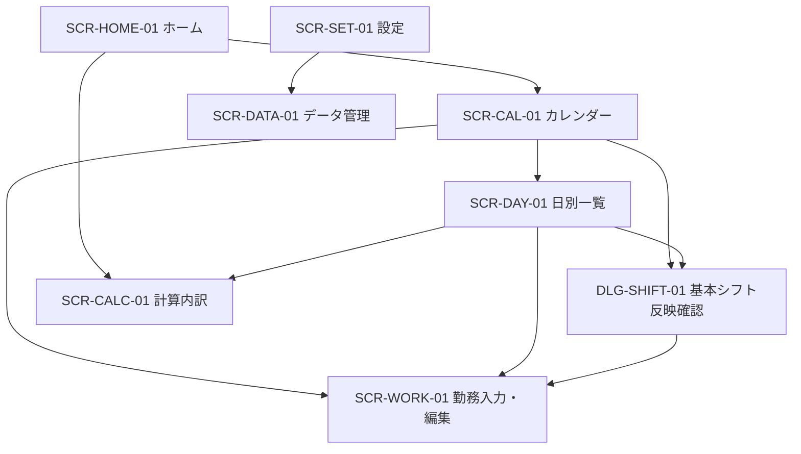
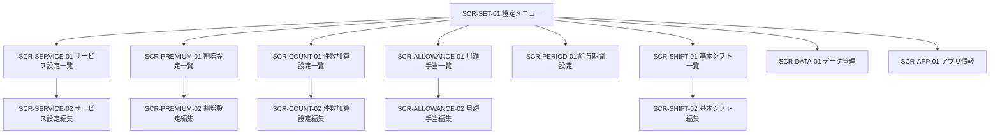

# 画面遷移・画面仕様書

## 1. 文書情報

| 項目 | 内容 |
| --- | --- |
| 文書名 | 画面遷移・画面仕様書 |
| ステータス | 初期リリース向け設計 |
| 対象 | Androidスマートフォン縦向き画面 |
| 作成日 | 2026-08-15 |

## 2. 目的と前提

本書は、[要件定義書](requirements.md)の画面要件と利用シナリオを、.NET MAUI XAMLで実装可能な画面構成、遷移および操作仕様へ具体化する。

- 単一利用者向けとし、ログイン画面や利用者切替画面は設けない。
- 主な利用端末はAndroidスマートフォンの縦向きとする。
- 主要な日々の勤務入力は1画面内で完了させる。
- 外部通信を前提とする画面や待機状態は設けない。
- 金額、日付、時刻、エラーおよび確認メッセージは日本語で表示する。
- 設定変更の対象年月と、集計対象の給与期間を常に区別して表示する。

## 3. ナビゲーション構成

### 3.1 ルート構成

初期設定完了後は、下部ナビゲーションに次の3項目を表示する。

| 項目 | 初期画面 | 目的 |
| --- | --- | --- |
| ホーム | `SCR-HOME-01` | 現在の給与期間と給与見込み額を確認する |
| カレンダー | `SCR-CAL-01` | 日付を選択し、勤務を確認・登録する |
| 設定 | `SCR-SET-01` | 給与設定、基本シフトおよびデータを管理する |

勤務入力、計算内訳、設定編集などは各ルートの上へスタック遷移する。確認、単純な選択および反映前プレビューはダイアログまたはボトムシートで表示する。

### 3.2 起動時の分岐

初期設定の途中でアプリが終了した場合は、保存済みの最後のステップから再開する。完了フラグは、給与計算に必要な設定の検証に成功した後だけ更新する。

### 3.3 通常利用時の主要遷移

### 3.4 設定画面の遷移

## 4. 画面一覧

| 画面ID | 画面名 | 種別 | 主な遷移元 |
| --- | --- | --- | --- |
| `SCR-INIT-01` | 初回案内 | 初期設定 | 起動 |
| `SCR-INIT-02` | 締め日設定 | 初期設定 | 初回案内 |
| `SCR-INIT-03` | サービス・単価設定 | 初期設定 | 締め日設定 |
| `SCR-INIT-04` | 加算設定 | 初期設定 | サービス・単価設定 |
| `SCR-INIT-05` | 設定確認 | 初期設定 | 加算設定 |
| `SCR-HOME-01` | ホーム／給与期間サマリー | ルート | 起動、下部ナビゲーション |
| `SCR-CAL-01` | 月間カレンダー | ルート | ホーム、下部ナビゲーション |
| `SCR-DAY-01` | 日別一覧 | 詳細 | カレンダーの選択日サマリー |
| `SCR-WORK-01` | 勤務入力・編集 | 編集 | カレンダー、日別一覧、複製、基本シフト反映 |
| `SCR-CALC-01` | 計算内訳 | 詳細 | ホーム、日別一覧 |
| `SCR-SET-01` | 設定メニュー | ルート | 下部ナビゲーション |
| `SCR-SERVICE-01` | サービス設定一覧 | 設定 | 設定メニュー |
| `SCR-SERVICE-02` | サービス設定編集 | 設定 | サービス設定一覧 |
| `SCR-PREMIUM-01` | 割増設定一覧 | 設定 | 設定メニュー |
| `SCR-PREMIUM-02` | 割増設定編集 | 設定 | 割増設定一覧 |
| `SCR-COUNT-01` | 件数加算設定一覧 | 設定 | 設定メニュー |
| `SCR-COUNT-02` | 件数加算設定編集 | 設定 | 件数加算設定一覧 |
| `SCR-ALLOWANCE-01` | 月額手当一覧 | 設定 | ホーム、設定メニュー |
| `SCR-ALLOWANCE-02` | 月額手当編集 | 設定 | 月額手当一覧 |
| `SCR-PERIOD-01` | 給与期間設定 | 設定 | 設定メニュー |
| `SCR-SHIFT-01` | 基本シフト一覧 | 設定 | 設定メニュー |
| `SCR-SHIFT-02` | 基本シフト編集 | 設定 | 基本シフト一覧 |
| `SCR-DATA-01` | データ管理 | 設定 | 設定メニュー |
| `SCR-APP-01` | アプリ情報 | 設定 | 設定メニュー |

主な補助UIは次のとおりとする。

| UI ID | 名称 | 目的 |
| --- | --- | --- |
| `DLG-SHIFT-01` | 基本シフト反映確認 | 反映予定と重複候補を保存前に確認する |
| `DLG-COPY-01` | 日単位複製 | 複製元、複製先および重複候補を確認する |
| `DLG-IMPORT-01` | インポート確認 | 検証結果と全置換対象を確認する |
| `DLG-DISCARD-01` | 未保存変更の破棄確認 | 編集内容の誤破棄を防ぐ |
| `DLG-DELETE-01` | 削除確認 | 元に戻せない削除を確認する |

## 5. 共通表示・操作規則

### 5.1 対象年月と給与期間

- 給与設定画面では、画面上部に`設定対象年月: YYYY年M月`を常時表示する。
- ホームと計算内訳では、`給与算定開始日`と`給与算定終了日`を省略せず表示する。
- 給与期間が年をまたぐ場合は両方の日付に年を表示する。
- 月額手当画面では`対象給与期間: YYYY年M月分（開始日～終了日）`と表示する。
- 対象年月を変更して未保存の編集が失われる場合は、変更前に`DLG-DISCARD-01`を表示する。

### 5.2 保存と戻る操作

- 編集画面の主要操作は`保存`とし、片手で到達しやすい画面下部へ固定する。ソフトウェアキーボード、Androidのシステムバーおよび画面のセーフエリアでボタンが隠れないようにする。
- Androidの戻る操作で未保存変更がある場合は、破棄確認を表示する。
- 保存に成功した場合は前画面へ戻り、短い成功メッセージを表示する。
- 入力エラーがある場合は画面に留まり、最初のエラー項目へフォーカスを移動する。
- 二重タップによる多重保存を防止するため、保存処理中は保存ボタンを無効化する。

### 5.3 削除と無効化

- 勤務記録、基本シフトおよび月額手当の削除前には確認を表示する。削除をスワイプだけの隠れた操作にしない。
- 使用済みのサービス種類と時間区分は、物理削除ではなく対象年月で無効化する。無効化後も同じ設定スナップショットに根拠が残る既存勤務は計算する。
- 割増または件数加算を無効化すると既存勤務の金額が変わる場合は、影響件数と変更前後の見込み差額を保存前に表示する。
- 単価行の削除などによって対象年月の勤務記録が未計算になる場合は、影響件数と理由を保存前に表示する。

### 5.4 入力UI

- 金額は数値キーボードを使用し、入力欄外または接尾辞で`円`を表示する。
- 時刻はAndroid標準の時刻選択UIを使用する。
- 勤務時間は時間と分、または合計分を誤認しにくいUIで入力する。
- 表示名、金額、時刻などは、項目ラベルを入力値が入った後も確認できる形式にする。
- 必須項目だけに必須表示を付け、計算設定上不要な項目は非表示または無効化する。
- 一般的な勤務入力では、詳細設定を折りたたみ、よく使うサービス、勤務時間または時刻、給与プレビューおよび保存を1画面内に表示する。

### 5.5 共通状態

各一覧・詳細画面は、通常状態に加えて次の状態を扱う。

| 状態 | 表示方針 |
| --- | --- |
| データなし | 理由と最初に行う操作を表示する |
| 読み込み中 | 操作を妨げない短時間の進捗表示を使用する |
| 未計算 | 金額を推測せず、足りない設定と修正先を表示する |
| 保存失敗 | 入力内容を保持したまま、再試行方法を表示する |
| ファイル処理失敗 | 既存データが変更されていないことと理由を表示する |

## 6. 初期設定画面

### 6.1 `SCR-INIT-01` 初回案内

表示内容：

- アプリが給与見込み額を計算するものであること
- 正式な給与明細を代替しないこと
- データが端末内だけに保存されること
- 端末故障やアンインストールに備えてエクスポートが必要なこと

主要操作は`設定を始める`とする。

### 6.2 `SCR-INIT-02` 締め日設定

入力項目：

- 締め日：1～31または月末
- 適用開始給与期間：初回設定では現在の給与期間を初期値とする

設定結果として算定開始日と算定終了日の例をプレビューする。

初期設定で必須なのは締め日の選択だけとし、制度説明を読まないと選べない専門用語を追加しない。

### 6.3 `SCR-INIT-03` サービス・単価設定

初期サービス設定の一覧を表示し、各行で次を確認・編集できるようにする。

- サービス設定名
- サービス種類
- 時間区分または標準勤務時間
- 単価方式
- 基本単価
- 使用状態

初期値を一括確認でき、サービス設定の追加と編集へ遷移できること。給与計算に必要な単価が未設定の行は明示する。

初期状態では使用中のサービスだけを展開し、使用しない候補はまとめて無効化できるようにする。初回設定の完了に必要なのは、少なくとも1つの使用サービスと、そのサービスを計算できる単価とする。

### 6.4 `SCR-INIT-04` 加算設定

休日、夜間、件数加算の初期項目を表示し、各項目について`使用する`または`使用しない`を選択させる。初期選択は`使用しない`とし、使用する項目だけ金額、割合、時間帯などの必須値を入力させる。`今は設定しない`で次へ進めること。

月額手当と基本シフトは後から設定できる任意項目として案内し、初回設定完了の必須条件にはしない。

### 6.5 `SCR-INIT-05` 設定確認

次を一覧表示する。

- 締め日と最初の給与期間
- 使用可能なサービス設定数
- 単価未設定または設定不備の件数
- 有効な割増と件数加算

不備がある場合は該当ステップへ戻る操作を表示する。計算可能性の検証に成功した場合だけ`設定を完了する`を有効にする。

## 7. 日常利用画面

### 7.1 `SCR-HOME-01` ホーム／給与期間サマリー

表示内容：

- 選択中の給与算定開始日と給与算定終了日
- 給与見込み合計
- 基本給与、割増、件数加算、月額手当の小計
- 未計算の勤務記録数
- バックアップ案内の表示条件を満たす場合だけ、短いエクスポート案内

操作：

- 前給与期間、次給与期間、現在の給与期間へ移動
- 計算内訳を開く
- 現在日を選択したカレンダーを開き、勤務の確認または追加を開始する
- 対象給与期間の月額手当を開く
- 未計算件数がある場合は対象日一覧へ移動

バックアップ案内は、勤務記録があり、未エクスポートの場合、または最後のエクスポート後にデータ変更があり30日以上経過した場合だけ表示する。案内は給与見込み合計より目立たせず、`後で`を選択した場合は7日間再表示しない。

### 7.2 `SCR-CAL-01` 月間カレンダー

各日には次の状態を識別可能な記号または短い表示を使用する。

- 勤務記録あり
- 未計算の勤務記録あり
- 選択中の日付
- 本日

画面上部で前月、翌月および当月へ移動できる。日付を選択しても別画面へ自動遷移せず、カレンダー下部に次を表示する。

- 選択日、曜日および日別給与見込み合計
- 勤務記録の先頭数件と総件数。全件を開く操作で`SCR-DAY-01`へ遷移
- `勤務を追加`の主要ボタン。`SCR-WORK-01`を選択日で直接開く
- 基本シフト候補がある場合は件数と`確認して追加`操作

基本シフト候補は日付選択時に生成するが、確認ダイアログを自動表示しない。利用者が`確認して追加`を選択した場合だけ`DLG-SHIFT-01`を開く。

小さい画面で金額表示が過密になる場合は、カレンダーセルには記録状態だけを表示し、選択日の給与額を画面下部のサマリーへ表示する。

### 7.3 `SCR-DAY-01` 日別一覧

表示内容：

- 対象日と曜日
- 日別給与見込み合計
- 勤務記録ごとのサービス名、勤務時間、給与見込み額、計算状態
- 基本シフトからの反映候補

操作：

- 新規勤務を追加
- 勤務記録を編集または削除
- 勤務記録の計算内訳を表示
- 基本シフトを反映
- 別の日の勤務記録をこの日へ複製

対象曜日に有効な基本シフトがある場合は、カレンダーの日付選択後に反映候補を作成する。ただし、自動保存も確認画面の自動表示もせず、利用者が反映候補を開いた場合だけ`DLG-SHIFT-01`で確定を求める。同じ基本シフト由来の勤務記録または類似する既存記録がある場合は、重複候補として表示する。

### 7.4 `SCR-WORK-01` 勤務入力・編集

入力項目：

| 項目 | 必須条件 |
| --- | --- |
| 勤務日 | 常に必須 |
| サービス設定 | 登録済みの組み合わせを利用する場合 |
| サービス種類 | 常に必須。サービス設定選択時は自動入力 |
| 時間区分 | 時間区分を利用する場合 |
| 入力方式 | `開始・終了時刻`または`勤務時間` |
| 開始時刻・終了時刻 | `開始・終了時刻`方式の場合。勤務時間は自動算出 |
| 勤務時間 | 勤務時間入力方式の場合 |
| 開始時刻 | 勤務時間入力方式で、選択日・サービスに時刻条件付き割増が適用可能な場合。終了時刻は自動算出 |

挙動：

- サービス設定を選択すると、サービス種類と標準時間を自動入力する。
- 選択した勤務日の設定スナップショットでサービス種類と時間区分が使用可能なサービス設定だけを通常候補へ表示する。使用できない候補は自動変換せず、必要な場合だけ`利用できない候補`として理由と修正先を表示する。
- `任意の時間で入力`を選択した場合は、サービス種類と勤務時間を直接指定できる。
- 時刻入力方式では、終了時刻が開始時刻以前の場合を翌日として扱う旨を表示する。
- 勤務時間入力方式を選択していて、選択日・サービスに時刻条件付き割増が適用可能な場合は、開始時刻だけを追加表示し、終了時刻を勤務時間から自動算出する。
- 直前に確定した値を初期選択候補として使用する。
- よく使うサービス設定と直近に使ったサービスを画面上部の候補として表示し、選択後も保存前に編集できる。
- 保存前に給与見込み額をプレビューする。計算できない場合は金額の代わりに理由を表示する。

編集画面では、勤務日を別の年月へ変更すると適用設定も変わることを保存前に表示する。

### 7.5 `SCR-CALC-01` 計算内訳

勤務記録単位の表示：

- 勤務内容と計算対象時間
- 適用された基本単価と単価方式
- 基本給与
- 適用された割増の表示名、条件、計算対象時間および金額
- 件数加算の表示名と金額
- 勤務記録合計
- 使用した設定対象年月

給与期間単位では、日別小計、基本給与合計、割増種別ごとの合計、件数加算合計、月額手当および期間合計を表示する。

## 8. 設定画面

### 8.1 `SCR-SET-01` 設定メニュー

次のグループに分ける。

| グループ | 項目 |
| --- | --- |
| 給与設定 | サービス・単価、割増、件数加算、月額手当、給与期間 |
| 入力補助 | よく使うサービス設定、基本シフト |
| データ | エクスポート、インポート |
| アプリ | アプリ情報 |

給与設定グループの上部に設定対象年月を表示し、変更できるようにする。入力補助とデータ管理は年月に依存しないため、設定対象年月の適用範囲に含めない。

初期表示は現在年月とし、対象年月だけを変更することを常時表示する。新しく使用する年月は直近月の設定を自動で引き継ぐ。既存の対象年月を直近月と同じ内容へ戻す`前月の設定をコピー`操作を提供し、保存前に影響件数と見込み差額を表示する。

### 8.2 `SCR-SERVICE-01` サービス設定一覧

よく使うサービス設定名、サービス種類、時間区分または`任意時間`、標準時間、選択中年月の単価方式、単価および有効状態を一覧表示する。時間区分があるサービス種類にも、任意時間入力用のサービス種類単位単価を独立した行として表示する。並べ替え、追加、編集および無効化を提供する。

一覧では`入力候補（全期間共通）`と`YYYY年M月の給与設定`を見出しまたはラベルで区別し、どの変更が対象年月だけに適用されるかを明示する。

同一のサービス種類と時間区分を複数のサービス設定から入力補助として参照してよい。ただし、単価の適用先が重複または曖昧になる構成は保存時に検出する。

### 8.3 `SCR-SERVICE-02` サービス設定編集

入力項目：

- 入力候補（全期間共通）：サービス設定名、初期選択するサービス種類・時間区分、標準勤務時間、表示順、候補としての有効状態
- 選択中年月の給与設定：サービス種類、時間区分名と標準時間（任意時間用のサービス種類単位単価では未設定）、単価方式、基本単価、サービス種類と時間区分それぞれの有効状態

サービス種類または時間区分そのものを追加する操作と、既存の組み合わせを入力候補として登録する操作を区別する。任意時間用には、時間区分を作らずサービス種類単位の単価だけを追加できる。サービス種類と時間区分の有効状態は別々に編集する。全期間共通の入力候補を変更する場合は、作成済み勤務記録と過去年月の給与計算は変わらないことを保存前に表示し、対象年月の給与設定と入力候補の変更を1つの保存操作として確定する。

### 8.4 `SCR-PREMIUM-01`／`SCR-PREMIUM-02` 割増設定

一覧では表示名、加算方式、主な条件、有効状態を表示する。編集画面では次を設定する。

- 表示名
- 対象曜日
- 国民の祝日を対象とするか
- 個別日付
- 開始時刻・終了時刻
- 加算方式
- 割合または固定額
- 対象サービス種類
- 有効状態

対象条件を何も指定しない場合の意味を画面上で明示し、意図しない全件適用を防止する。

### 8.5 `SCR-COUNT-01`／`SCR-COUNT-02` 件数加算設定

表示名、1件当たり加算額、対象サービス種類および有効状態を設定する。対象サービスを指定しない場合は全サービス対象であることを表示する。

### 8.6 `SCR-ALLOWANCE-01`／`SCR-ALLOWANCE-02` 月額手当

対象給与期間を明示し、その期間に登録された手当の表示名、金額および合計を表示する。追加、編集および削除を提供する。

### 8.7 `SCR-PERIOD-01` 給与期間設定

入力項目：

- 締め日：1～31または月末
- 適用開始給与期間年月

変更前後の最初の給与算定開始日と終了日をプレビューし、指定月より前へ影響しないことを表示する。

### 8.8 `SCR-SHIFT-01`／`SCR-SHIFT-02` 基本シフト

曜日ごとにグループ化し、同じ曜日内で複数の基本シフトを並べ替えられるようにする。編集項目は勤務入力と同じ勤務内容、表示順および有効状態とする。

設定不備の基本シフトには警告を表示し、勤務記録へ黙って反映しない。

## 9. データ管理・アプリ情報

### 9.1 `SCR-DATA-01` データ管理

エクスポート：

1. 暗号化されないファイルであることを表示する。
2. 利用者が続行した場合にAndroid標準の保存先選択を開く。
3. 成功時に作成日時を記録し、画面へ表示する。
4. 失敗時は既存データに影響がないことと対応方法を表示する。

インポート：

1. Android標準のファイル選択を開く。
2. ファイル形式、バージョン、必須データおよび参照整合性を検証する。
3. `DLG-IMPORT-01`で件数、対象範囲および全置換であることを表示する。
4. 利用者の確定後に置換する。
5. 失敗時または取消時は既存データを変更しない。

### 9.2 `SCR-APP-01` アプリ情報

表示内容：

- アプリ名
- 表示バージョン
- ビルド番号
- データ形式バージョン
- 本アプリの給与額が見込みである旨

利用者向け診断情報の表示やログ出力は設けない。

## 10. ダイアログ仕様

### 10.1 `DLG-SHIFT-01` 基本シフト反映確認

- 対象日
- 反映予定の勤務記録一覧
- 既存勤務記録一覧または件数
- 同じ基本シフト由来の登録済み記録
- 反映できない基本シフトと理由

利用者が反映対象を確認して確定するまで保存しない。重複候補がある場合も一律禁止せず、対象ごとに反映するか選択できるようにする。

### 10.2 `DLG-COPY-01` 日単位複製

- 複製元日と複製先日
- 複製される勤務記録数
- 複製先の既存勤務記録数
- 設定年月が異なる場合は再計算される旨

複製先では各勤務記録を独立した新規記録として保存する。

### 10.3 `DLG-IMPORT-01` インポート確認

- エクスポート作成日時
- データ形式バージョン
- 設定年月、基本シフト、勤務記録および月額手当の件数
- 現在のデータをすべて置き換える旨
- 取消と実行

確認前にはデータベースを変更しない。

## 11. アクセシビリティ

- アイコンだけで状態や操作を表さず、テキストまたはアクセシビリティラベルを併用する。
- 色だけで記録あり、未計算、エラーを区別しない。
- 文字サイズを拡大しても、金額、保存、戻るおよびエラー内容を利用できるようにする。
- タップ対象は隣接する操作との誤操作が起きにくい大きさと間隔にする。
- スクリーンリーダーでは、金額を桁ごとではなく金額として読み上げられるラベルを設定する。
- フォーカス順は表示順および入力順と一致させる。

## 12. 画面状態の保持

- プロセス存続中は、選択中の給与期間、カレンダー月および設定対象年月を保持する。
- アプリ再起動時は現在日を含む給与期間と現在月を初期表示する。
- 編集途中の勤務記録を通常終了後まで永続保存する機能は初期リリースの対象外とする。
- Androidによる一時的な画面再生成では、未保存入力を可能な範囲でViewModelの状態として保持する。
- インポート完了後はナビゲーションスタックと表示中キャッシュを破棄し、ホームから読み直す。

## 13. プロトタイプで検証する事項

次はUI実装開始前または最初の画面プロトタイプで確認する。

- 小さい画面でのサービス設定一覧と単価編集の最終レイアウト
- カレンダーセルへ日別金額を直接表示できる画面幅か。収まらない場合は仕様どおり選択日サマリーだけに表示する
- 割増条件編集における曜日、祝日、個別日の組み合わせ表現
- 文字サイズ最大時の画面分割、キーボード表示時の固定保存ボタンおよびエラー表示の配置
- 代表端末でのAndroid戻る操作、時刻選択およびファイル選択の実動作
