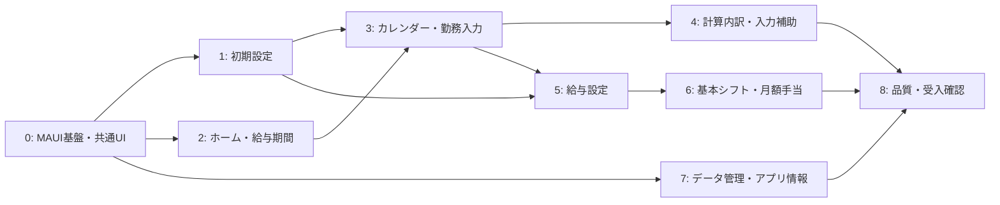

# 画面実装設計・実装ロードマップ

## 1. 目的

本書は、[画面遷移・画面仕様書](screen_specification.md)で定義された画面を、Android 向け .NET MAUI XAML アプリケーションとして実装する際の分割単位、責務境界および実装順を定める。

対象は Presentation 層である。給与計算、設定スナップショット、SQLite、インポート／エクスポートの業務ルールを ViewModel や XAML に複製しない。これらは既存の Application 層のユースケースを通して利用する。

### 1.1 前提と現状

- UI フレームワークは ADR-0001 に従い、**.NET MAUI XAML + C#** とする。
- 現在のソリューションには Domain／Application／Infrastructure と各テストプロジェクトがあり、MAUI の App プロジェクトは未作成である。
- Application 層には、初期設定、勤務入力、給与照会、月設定、給与期間・手当、基本シフト、データ転送のユースケース契約が用意されている。
- 初期リリースは Android 縦向き、オフライン、単一利用者である。

## 2. 設計原則

1. **画面ではなく利用目的で分ける。** ページ、ViewModel、ユースケース呼び出しを 1 対 1 に固定せず、共通する編集・確認・状態管理を再利用する。
2. **画面状態は ViewModel、業務判断は Application 層。** 表示中の年月、入力中の値、ローディング状態、ナビゲーション要求は ViewModel に置く。金額計算、保存可否、設定影響、重複候補判定はユースケース結果を表示する。
3. **まず縦切りで完成させる。** 見た目だけの全画面を先に並べず、「起動して設定し、勤務を登録し、給与を見られる」最小導線を早期に動かす。
4. **画面仕様の ID を追跡可能にする。** Page、ViewModel、テスト名、必要ならコメントに `SCR-*`／`DLG-*` を記載する。
5. **年月と給与期間を別の状態として扱う。** `YearMonth`（設定対象年月・カレンダー月）と `PayrollPeriodKey`（給与集計期間）を文字列に変換して保持しない。
6. **未保存変更を共通制御する。** 編集画面はすべて `IsDirty`、保存中状態、破棄確認、入力エラーの先頭フォーカスを同じ仕組みで扱う。

## 3. Presentation プロジェクトの構成

MAUI プロジェクト名は `TkpSalaryCalculator.App` とし、Application と Infrastructure を参照する。Infrastructure の生成・初期化、SQLite パス、Android のファイル選択／保存は App 側の Composition Root に閉じ込める。

```text
src/TkpSalaryCalculator.App/
  App.xaml / App.xaml.cs                 # テーマ、アプリ全体のリソース
  MauiProgram.cs                         # DI、Infrastructure と UseCase の組み立て
  AppShell.xaml / AppShell.xaml.cs        # 初期設定／通常画面のルート切替
  Platforms/Android/                     # FilePicker・保存先選択などの端末固有処理
  Navigation/                             # 画面遷移、戻る、深いリンクなしのルート定義
  Presentation/
    Common/                               # ViewModel 基底、Result/Issue 表示、Busy、Dirty
    Controls/                             # 金額、期間見出し、空状態、固定保存バー等
    Converters/                           # 表示専用の変換
    Services/                             # ダイアログ、Toast、時刻選択、ファイル選択の抽象化
    Features/
      Setup/                              # SCR-INIT-01 ～ 05
      Home/                               # SCR-HOME-01, SCR-CALC-01
      Calendar/                           # SCR-CAL-01, SCR-DAY-01, SCR-WORK-01, DLG-COPY-01
      Settings/                           # SCR-SET-01 ～ SCR-SHIFT-02
      DataManagement/                     # SCR-DATA-01, DLG-IMPORT-01, SCR-APP-01
  Resources/
    Styles/                               # 色、文字、余白、状態別スタイル
    Strings/                              # 表示文言（初期リリースは日本語）
```

各 `Features/<機能>` は原則として次を持つ。

- `XxxPage.xaml`／`XxxPage.xaml.cs`: レイアウトと MAUI 固有の UI 操作だけ。
- `XxxViewModel.cs`: 画面状態、コマンド、ユースケースへの依頼、画面イベント。
- `XxxViewState.cs`（必要な場合）: 複数プロパティからなる表示状態。
- `XxxNavigation.cs`（必要な場合）: 画面間で渡す最小限の引数。

## 4. 共通部品の分割

| 部品 | 主な責務 | 最初の利用画面 |
| --- | --- | --- |
| `AppShell` とルートガード | 初期設定完了状態による起動先の振り分け、下部ナビゲーション、戻る遷移 | 初期設定、ホーム |
| `ViewModelBase` | `IsBusy`、キャンセル、例外の利用者向け表示、画面再生成時の状態保持 | 全画面 |
| `EditableViewModelBase` | `IsDirty`、保存中の二重実行防止、戻る時の `DLG-DISCARD-01` | 勤務・全編集画面 |
| `IssuePresenter` | Application 層の `IssueDto` を項目エラー／画面メッセージへ変換 | 勤務入力、設定編集 |
| `PayrollPeriodHeader` | 給与算定開始日・終了日の完全表示、前後期間移動 | ホーム、内訳、手当 |
| `SettingsMonthHeader` | `設定対象年月` の表示・変更、未保存変更の保護 | 給与設定群 |
| `Money`／`Duration` 表示 | 日本円、時間・分、未計算理由の一貫した表示 | 全画面 |
| `EmptyStateView`／`ErrorStateView` | データなし・保存失敗・未計算時の理由と次の操作 | 一覧・詳細画面 |
| `FixedSaveBar` | セーフエリア・キーボードを考慮した固定保存ボタン | 全編集画面 |
| `ConfirmationDialogService` | 削除、破棄、基本シフト、複製、インポートの確認 | `DLG-*` |
| `AndroidFileService` | Storage Access Framework を介したファイルの読み書き。ストリームのみを DataTransferUseCase に渡す | データ管理 |

## 5. 機能単位と依存関係



依存の要点は、初期設定とホームがアプリの入口、勤務入力が日常利用の中心、設定が入力・計算の前提を提供することである。設定画面をすべて完成させるまで勤務入力を待たず、既存の初期値とユースケースを利用して縦切りで進める。

## 6. 推奨する実装順

### 0. MAUI 基盤と表示規約

**成果物**: App プロジェクト、DI、テーマ、Shell、共通 ViewModel／ダイアログ／固定保存バー、Android の最低限の設定。

- `MauiProgram` で Infrastructure と各 Application ユースケースを登録する。
- アプリ起動時に `IInitialSetupUseCase.GetStateAsync` を呼び、初期設定か通常 Shell かを決定する。
- 下部ナビゲーションはホーム・カレンダー・設定の 3 ルートだけを持つ。
- 読み込み中、空状態、未計算、保存失敗の表示パターンを先に用意する。
- 金額、日付、時刻、エラーを日本語表記に統一し、アクセシビリティラベルを組み込む。

**完了条件**: 空のホームを起動でき、初期設定の未完了時には通常画面へ入れず、画面回転や Android による再生成後も選択状態を復元できる。

**状態**: 完了

### 1. 初期設定（`SCR-INIT-01` ～ `SCR-INIT-05`）

**分割**: ウィザードの各ステップを独立 Page にせず、`InitialSetupFlowPage` とステップ別 ContentView／ViewModel に分割する。進捗保存と完了判定の入口は `InitialSetupFlowViewModel` に集約する。

- 案内、締め日、サービス・単価、加算、確認の順で実装する。
- ステップ移動時は `SaveProgressAsync`、完了時だけ `CompleteAsync` を使う。
- 完了ボタンの可否は ViewModel の推測ではなく `InitialSetupStateDto` の検証結果に従う。

**完了条件**: アプリ終了後に最後の保存済みステップから再開でき、検証成功後だけホームへ遷移する。

**状態**: 完了

### 2. ホームと給与期間サマリー（`SCR-HOME-01`）

**分割**: `HomeViewModel` は給与期間キー、`PayrollPeriodHeaderViewModel` は期間移動、`BackupReminderViewModel` は案内表示を担当する。

- `ISalaryQueryUseCase.GetPayrollPeriodAsync` で合計・内訳・未計算件数を取得する。
- `IBackupReminderUseCase` で条件付きのバックアップ案内と 7 日延期を実装する。
- カレンダー、内訳、月額手当、未計算日へ遷移できるようにする。

**完了条件**: 開始日・終了日を常に明記し、期間移動で小計・合計・未計算件数が更新される。

**状態**: 2回目レビュー指摘対応済み

### 3. カレンダー、日別一覧、勤務入力（`SCR-CAL-01`、`SCR-DAY-01`、`SCR-WORK-01`）

これは最優先の縦切り機能である。入力、プレビュー、保存、再表示までを一つのリリース可能な単位とする。

| 単位 | ViewModel の責務 | 使用するユースケース |
| --- | --- | --- |
| 月間カレンダー | 表示月、選択日、日セル状態、選択日サマリー | `ISalaryQueryUseCase.GetCalendarMonthAsync` |
| 日別一覧 | 対象日、勤務行、日別合計、編集・削除遷移 | `GetDayAsync`、`IWorkRecordUseCase.GetForDateAsync` |
| 勤務編集 | 入力方式、候補、時刻／時間、プレビュー、保存、項目エラー | `GetInputOptionsAsync`、`PreviewAsync`、`SaveAsync` |
| 削除確認 | ID と表示名だけを保持し、確定後に削除 | `DeleteAsync` |

- カレンダーの日付選択は画面遷移させず、選択日サマリーと「勤務を追加」を表示する。
- 給与プレビューは編集値の変更後に明示操作または適切なデバウンスで更新する。失敗時は入力値を保持して理由を表示する。
- 設定不足による未計算は保存可能であり、入力矛盾は保存不可という違いを UI 上で明確にする。
- 日付をまたぐ勤務、時刻入力、勤務時間入力は Application 層が正規化した結果を表示する。

**完了条件**: 設定済みサービスで勤務を 1 件登録・編集・削除でき、カレンダー、日別合計、ホームの期間合計へ反映される。

**状態**: 

### 4. 計算内訳と日常入力補助（`SCR-CALC-01`、`DLG-COPY-01`）

- `SCR-CALC-01` は日別・勤務記録別・給与期間別の三段階で構成する。給与計算式を再計算せず、`DailySalaryDto` と `PayrollPeriodSummaryDto` の結果をそのまま表示する。
- 複製は必ず `PreviewCopyDayAsync` → `DLG-COPY-01` → `CopyDayAsync` の順とし、対象年月が異なる場合の再計算を確認画面に表示する。

**完了条件**: 利用者が表示金額の根拠と未計算理由を追跡でき、日単位複製で重複候補を確認してから確定できる。

**状態**: 

### 5. 給与設定（`SCR-SET-01`、サービス・割増・件数加算・給与期間）

**分割方針**: 設定メニューはナビゲーションのみを担当する。給与設定はすべて `SettingsMonthContext` を共有し、対象年月の切替、前月コピー、影響プレビューを一か所に集約する。

1. 設定メニューと設定対象年月ヘッダー
2. サービス・単価一覧／編集（`SCR-SERVICE-01`／`02`）
3. 割増一覧／編集（`SCR-PREMIUM-01`／`02`）
4. 件数加算一覧／編集（`SCR-COUNT-01`／`02`）
5. 給与期間設定（`SCR-PERIOD-01`）

- 月設定の保存は `PreviewReplacementAsync` を先に呼び、影響件数・見込み差額を表示して確認を受けた後、確認トークン付きの `CloneAndReplaceAsync` を呼ぶ。
- 前月コピーも `PreviewCopyPreviousMonthAsync` → 確認 → `CopyPreviousMonthAsync` とする。
- 締め日変更は `PreviewClosingRuleReplacementAsync` → 確認 → `ReplaceClosingRuleAsync` とする。
- 一覧・編集の UI は共通の `SettingsEditorPage` を無理に汎用化せず、入力フィールドと検証が異なる各設定で個別 ViewModel を持つ。対象年月、保存、破棄、影響確認だけを共通化する。

**完了条件**: 変更の対象年月と給与期間への影響を画面上で区別し、過去設定を黙って変更しない。

**状態**: 

### 6. 基本シフトと月額手当（`SCR-SHIFT-*`、`DLG-SHIFT-01`、`SCR-ALLOWANCE-*`）

- 基本シフトは曜日別一覧、編集、日付に対する候補プレビュー、反映確認の 4 単位に分ける。
- 反映は `PreviewForDateAsync` の結果を表示し、利用者が選択した ID のみを `ApplyAsync` へ渡す。候補の取得だけで保存してはならない。
- 月額手当は給与期間に属する独立した機能として実装し、勤務日や設定対象年月とは混同しない。

**完了条件**: 基本シフトは明示確認後だけ独立した勤務記録として登録され、後のシフト変更が既存記録を変えない。手当は対象給与期間の合計へ 1 回だけ反映される。

**状態**: 

### 7. データ管理とアプリ情報（`SCR-DATA-01`、`DLG-IMPORT-01`、`SCR-APP-01`）

- エクスポートは Android の保存先選択で得た書込みストリームを `ExportAsync` に渡す。ファイルパスや URI を Application 層へ渡さない。
- インポートは `PrepareImportAsync` の結果をダイアログに表示し、全置換の確認後だけ `CommitImportAsync` を呼ぶ。取消時は `DiscardImportAsync` を呼ぶ。
- インポート成功後は仕様どおり Shell のスタックとキャッシュを破棄し、ホームを読み直す。
- アプリ情報は Assembly の表示バージョン、ビルド番号、`GetFormatAsync` のデータ形式バージョンを表示する。

**完了条件**: 取消・検証失敗・ファイル失敗で既存データが変わらず、インポート確定後だけ全画面が最新データを表示する。

**状態**: 

### 8. 品質・受入確認

- ViewModel テスト: コマンドの活性／非活性、状態遷移、ユースケースエラー表示、年月・給与期間の切替、未保存変更の破棄確認。
- UI テストまたは端末確認: 初期設定再開、固定保存バーとソフトキーボード、Android 戻る、時刻選択、ファイル選択、最大文字サイズ。
- 手動受入シナリオ: 初期設定 → 勤務登録 → 未計算表示 → 設定補完 → 集計確認 → シフト反映 → バックアップ → 別データのインポート。

## 7. 画面と実装単位の対応表

| 画面仕様 | 実装単位 | 優先度 |
| --- | --- | --- |
| `SCR-INIT-01` ～ `05` | `Features/Setup` のフローとステップ ContentView | 1 |
| `SCR-HOME-01` | `Features/Home/HomePage`、期間ヘッダー、バックアップ案内 | 2 |
| `SCR-CAL-01` | `Features/Calendar/CalendarPage`、日セル View | 3 |
| `SCR-DAY-01` | `Features/Calendar/DayPage` | 3 |
| `SCR-WORK-01` | `Features/Calendar/WorkEditorPage`、プレビュー部 | 3 |
| `SCR-CALC-01` | `Features/Home/CalculationDetailPage` | 4 |
| `DLG-COPY-01` | `CopyDayDialogViewModel` | 4 |
| `SCR-SET-01` | `Features/Settings/SettingsMenuPage` | 5 |
| `SCR-SERVICE-*`、`SCR-PREMIUM-*`、`SCR-COUNT-*`、`SCR-PERIOD-01` | 月設定コンテキスト配下の一覧・編集 ViewModel | 5 |
| `SCR-SHIFT-*`、`DLG-SHIFT-01` | `Features/Settings/Shifts` と `Features/Calendar` の反映ダイアログ | 6 |
| `SCR-ALLOWANCE-*` | `Features/Settings/Allowances` | 6 |
| `SCR-DATA-01`、`DLG-IMPORT-01`、`SCR-APP-01` | `Features/DataManagement` | 7 |

## 8. 実装時の禁止事項と確認事項

- ViewModel から SQLite、JSON、SQL、Android URI を直接操作しない。
- XAML の Converter や code-behind に給与計算・設定スナップショット判定を実装しない。
- 基本シフト候補の表示時、インポートのプレビュー時、設定変更のプレビュー時に保存を発生させない。
- 設定変更画面で「設定対象年月」と「対象給与期間」を同じラベルや同じ状態変数にしない。
- 画面別に独自のエラー文言・保存中制御を増やさず、共通部品を使う。
- UI を作り始める前に、MAUI の対象 .NET／Android バージョンと端末最小 API をプロジェクトファイルで確定する。ADR-0001 の Android 10（API 29）以降という前提を満たすこと。

## 9. 最初の実装スプリントの到達点

最初のスプリントでは、次だけを完成対象とする。

1. `TkpSalaryCalculator.App` の作成、DI、起動時分岐、共通テーマ。
2. 初期設定の最小導線（締め日、少なくとも 1 つの計算可能なサービス、完了）。
3. ホームの給与期間サマリー。
4. カレンダーからの勤務 1 件の追加・プレビュー・保存・削除。

この到達点で、画面実装の基盤と最重要の利用価値を同時に検証できる。以後は本書の優先順に、内訳、設定全般、入力補助、データ管理を追加する。

## 10. 参照資料

- [要件定義書](requirements.md)
- [画面遷移・画面仕様書](screen_specification.md)
- [設定履歴・データモデル仕様書](setting_history_data_model.md)
- [データベース仕様書](database_specification.md)
- [ADR-0001 UIフレームワークの選定](adr/0001-ui-framework.md)
